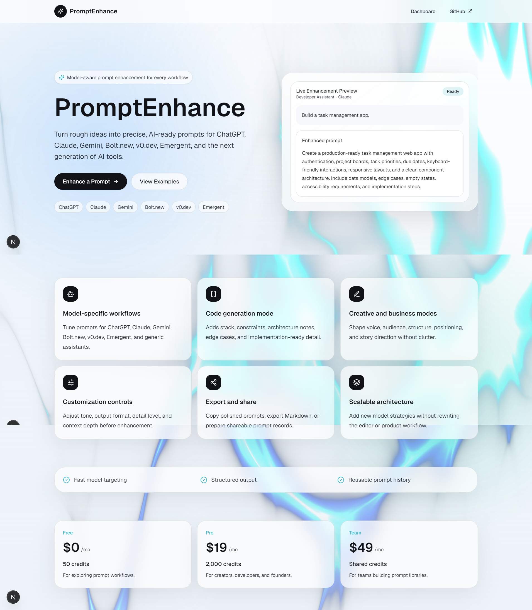
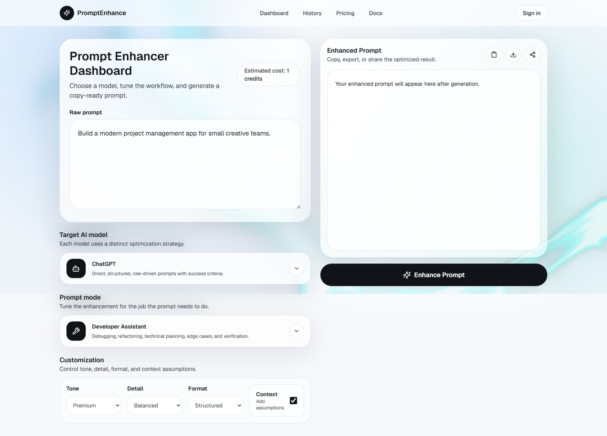

# PromptEnhance

PromptEnhance is a modern AI prompt enhancer that turns rough ideas into clear, structured, model-ready prompts. It supports model-aware workflows for tools like ChatGPT, Claude, Gemini, Bolt.new, v0.dev, and Emergent, with controls for tone, detail, format, and context depth.

**Live App:** [https://prompt-enhancer-six.vercel.app/](https://prompt-enhancer-six.vercel.app/)

## Preview

## Tech Used

- **Next.js App Router** - powers the application structure, routing, pages, and API endpoints.
- **React** - builds the interactive prompt editor, settings controls, and result preview experience.
- **TypeScript** - keeps prompt modes, model options, and API request shapes safer and easier to maintain.
- **Tailwind CSS** - provides the responsive glass-style interface and polished visual system.
- **Framer Motion** - adds smooth transitions and interface motion throughout the dashboard.
- **Vercel** - hosts the live production deployment.

## About

The app is designed for creators, developers, founders, and teams who want better AI outputs without rewriting prompts from scratch. Users can choose a target AI model, tune the prompt style, generate an enhanced version, and prepare the result for copying, exporting, or sharing.
